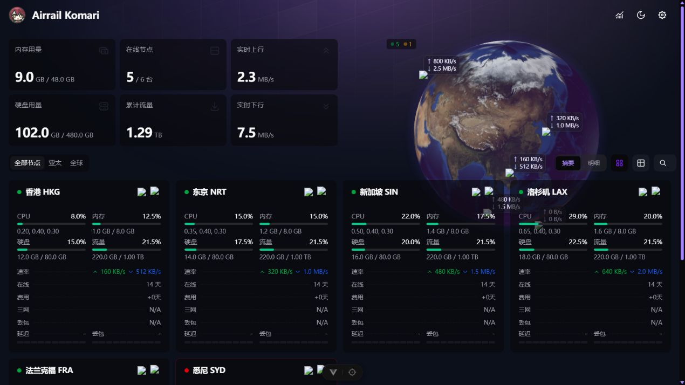
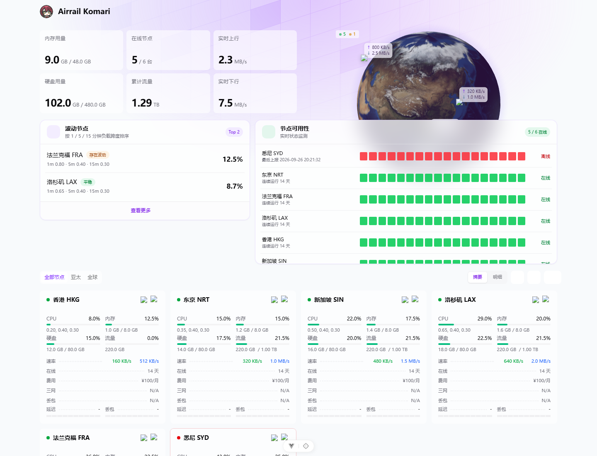
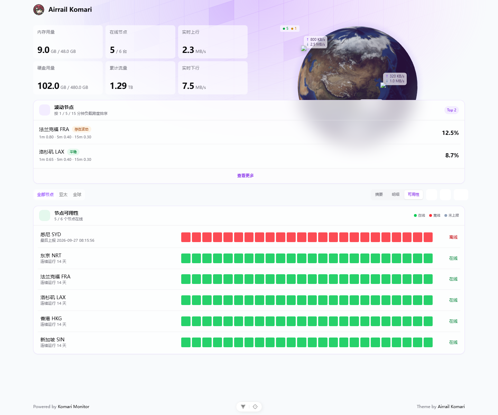
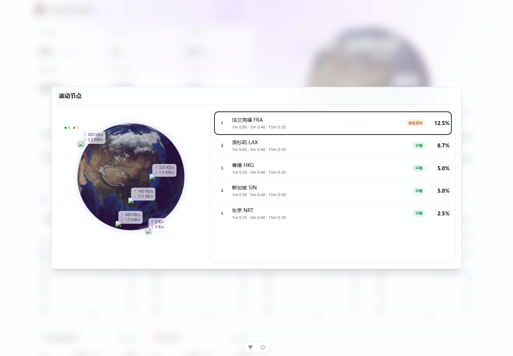
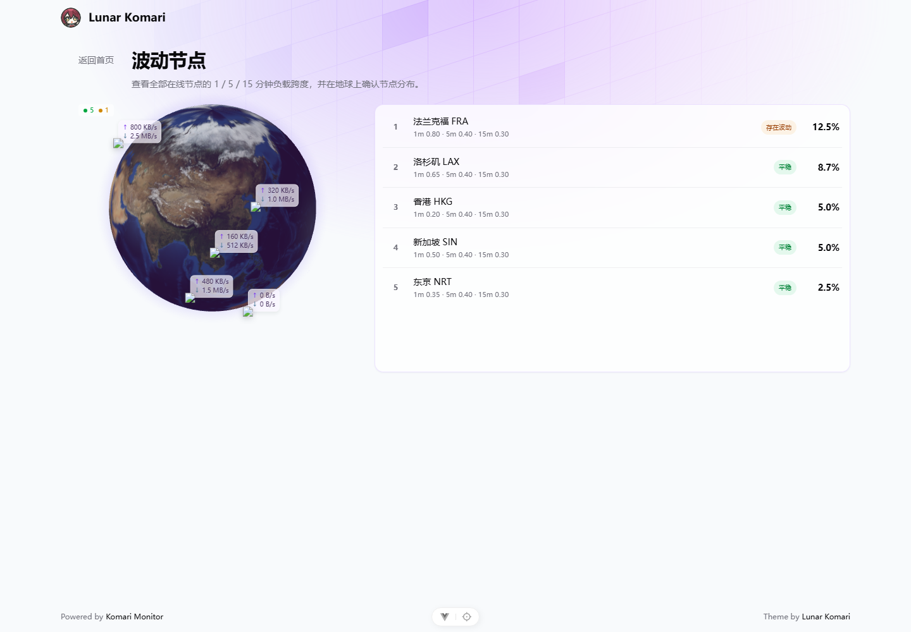
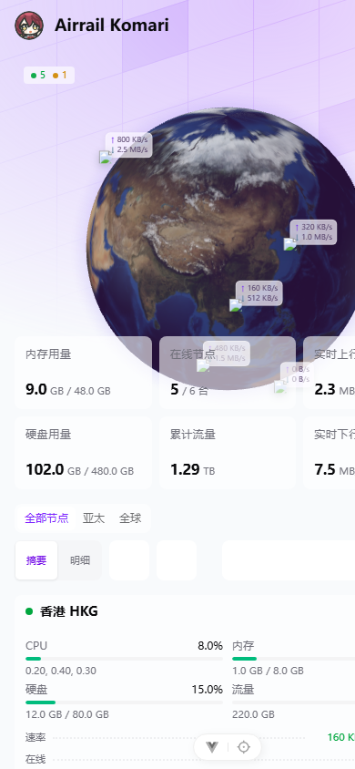

# Lunar Komari

一款面向 [Komari Monitor](https://github.com/komari-monitor/komari) 的紫色全球节点监控主题。Lunar Komari 在交互地球、节点状态和历史图表之上，加入节点可用性、负载波动、流量额度、成本与续费等展示能力。



## 界面预览

| 首页状态                                 | 节点可用性                                       |
| ---------------------------------------- | ------------------------------------------------ |
|  |  |

| 波动节点弹窗（默认）                              | 波动节点独立页面（可选）                             |
| ------------------------------------------------- | ---------------------------------------------------- |
|  |  |

| 手机端                                     |
| ------------------------------------------ |
|  |

预览使用的是虚构节点和演示数据，不包含真实服务器信息。

## 主要功能

### 全球节点视图

- 提供自转地球、静止地球、点状地图、汇总卡片和隐藏头部五种模式。
- 地球标记显示节点位置、在线状态以及实时上传和下载速率。
- 手机端可以直接查看地球上的节点信息。
- 页面进入后台时减少渲染，降低浏览器资源占用。

### 节点状态

- 卡片和列表两种节点布局，支持搜索、分组、筛选和排序。
- 在线徽章保持绿色且不使用呼吸动画。
- 流量有限时显示“已用流量 / 总流量”，无限流量时显示“已用流量”。
- “摘要”“明细”旁提供新的“可用性”展示模式，以时间格形式查看所有节点的在线情况。
- 支持将离线节点统一排到列表末尾。

### 波动节点

- 首页默认展示负载波动最明显的两个节点。
- 点击“查看更多”默认打开带模糊背景的弹窗，显示完整服务器列表和地球分布。
- 后台开启“波动节点独立页面”后，“查看更多”会跳转到独立页面。
- 独立页面的服务器列表随网页自然增长，不使用内部滚动容器。

### 延迟、丢包与历史分析

- 三网延迟与丢包支持摘要和明细模式。
- 可以自定义任务显示顺序；摘要最多显示 6 条，明细最多显示 3 条。
- 资源概况提供近五日流量趋势、资源压力、流量额度排行、实时流量、成本和续费时间线。
- 当历史记录关闭、数据不足、权限不足或接口不兼容时，界面会显示真实原因，不生成虚假数据。

### 成本、剩余时间与隐私

- “显示剩余价值”关闭后，访客无法看到剩余价值、节点剩余时间和个人价值入口。
- 已登录管理员仍可查看节点剩余时间，便于维护服务器；剩余价值继续遵循后台开关。
- “向访客公开成本”默认关闭，成本、续费金额和价格覆盖率仅管理员可见。
- 支持常见币种换算、续费预警天数和个人服务器价值统计。

### 界面与品牌

- 全局使用紫色主色，在线状态继续使用绿色语义色。
- 所有对话框使用半透明模糊背景。
- 获取站点名称前使用 `Lunar Komari` 作为默认名称。
- 可以分别隐藏页脚中的 `Powered by Komari` 和 `Theme by Lunar Komari`，备案信息不会受影响。
- 支持亮色、暗色、跟随系统、自定义图片或视频背景。
- 支持公告、备案信息、访客信息卡和隐藏未登录后台入口。

## 安装

### 使用 Release 主题包

1. 打开 [Releases](https://github.com/Foxtea267/Lunar-Komari/releases/latest)。
2. 下载名称以 `komari-theme-lunar-build-` 开头的 ZIP 文件。
3. 登录 Komari 后台，进入“设置 → 主题管理 → 导入主题”。
4. 上传下载的 ZIP，启用 **Lunar Komari** 并刷新前台。

请使用 Release 附件中的主题包。GitHub 自动生成的 `Source code (zip)` 和 `Source code (tar.gz)` 不能直接作为 Komari 主题安装包。

### 从仓库导入

在支持远程主题导入的 Komari 版本中，填写以下仓库地址：

```text
https://github.com/Foxtea267/Lunar-Komari
```

## 主题设置

完整配置位于 [`komari-theme.json`](komari-theme.json)。主要选项如下：

| 设置                   | 默认值      | 作用                                   |
| ---------------------- | ----------- | -------------------------------------- |
| 数据更新间隔           | `3` 秒      | 控制实时数据刷新频率。                 |
| RPC 连接模式           | `websocket` | WebSocket 不可用时可以切换为 HTTP。    |
| 默认视图模式           | `card`      | 选择卡片或列表节点视图。               |
| 头部展示模式           | `earth`     | 自转地球、静止地球、地图、卡片或隐藏。 |
| 波动节点               | 开启        | 在首页显示波动最大的两个节点。         |
| 波动节点独立页面       | 关闭        | 关闭时使用弹窗，开启时跳转独立页面。   |
| 节点可用性模式         | 开启        | 在摘要和明细旁加入可用性展示模式。     |
| 显示剩余价值           | 开启        | 控制访客可见的剩余价值和剩余时间。     |
| 向访客公开成本         | 关闭        | 控制访客是否能看到成本与续费金额。     |
| 隐藏 Powered by Komari | 关闭        | 隐藏左侧页脚品牌。                     |
| 隐藏 Theme by          | 关闭        | 隐藏右侧主题署名。                     |
| 自定义背景             | 关闭        | 配置亮色和暗色图片或视频背景。         |

## 数据与兼容性

- 主题使用 Komari 提供的公开 API、RPC 和历史记录接口，不包含独立后端。
- 已适配 Komari `1.3.2` 与 `1.4.3` 的历史数据结构，其他版本会根据接口能力自动回退。
- 地球需要浏览器支持 WebGL；不支持时仍可使用节点列表、卡片和大部分图表。
- 推荐使用较新的 Chrome、Edge、Firefox 或 Safari。
- 访客信息卡可能请求第三方 IP 地理信息服务；关闭该功能后不会发起相关查询。
- 汇率、Iconify 图标、地图数据和自定义背景可能访问对应的公共服务。

## 本地开发

环境要求：

- Node.js `^20.19.0` 或 `>=22.12.0`
- Bun `>=1.2.0`

```bash
bun install
bun run dev
bun run type-check
bun run lint:check
bun run test
bun run build
bun run verify:package
```

`bun run build` 会在仓库根目录生成可安装主题包：

```text
komari-theme-lunar-build-<git-hash>.zip
```

主题包根目录包含 `komari-theme.json`、`preview.png` 和编译后的 `dist/`。

## 技术栈

Vue 3、TypeScript、Vite 7、Tailwind CSS 4、Pinia、reka-ui、ECharts、Three.js、Globe.gl、vue-router 和 Iconify。

## 致谢

Lunar Komari 基于以下开源项目和主题继续开发：

- [Komari Monitor](https://github.com/komari-monitor/komari)
- [Emerald Globe Pro](https://github.com/allen0039/komari-theme-emerald-globe-pro)
- [Komari Emerald](https://github.com/Tokinx/komari-theme-emerald)
- [Komari Glassmorphism](https://github.com/sanrokamlan-prog/komari-theme-Glassmorphism)
- [Komari Naive](https://github.com/lyimoexiao/komari-theme-naive)

## 许可证

项目使用 [MIT License](LICENSE)。上游项目、图标、地图数据和公共服务同时遵循各自的许可证与使用条款。
